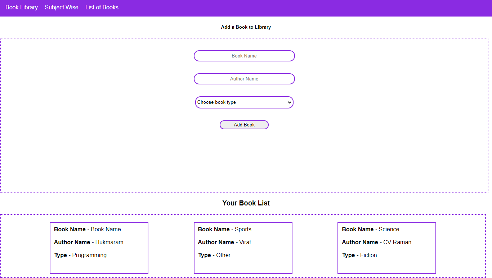

# Book-Adder
Notes App using HTML, CSS(not used bootstrap) Javascript. Aim of this project to get an Hands on experience of Javascript OOPS concept. using this app we can add todo notes and delete the same.I have used localStorage to store my notes.
# Screenshots

# Technologies
* HTML5
* CSS3
* Javascript-Classes and Method
* LocalStorage

# Author
Hukmaram Bishnoi
